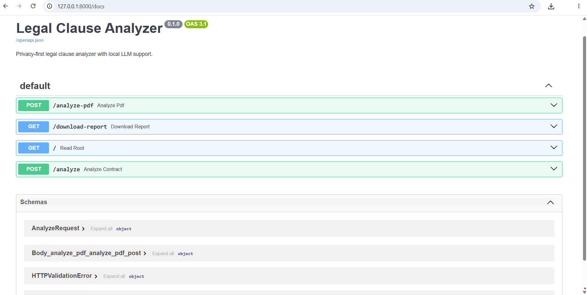

# ⚖️ Legal Clause Analyzer


 

A privacy-first AI-powered legal contract analyzer that detects legal clauses, evaluates GDPR and EU AI Act compliance, calculates risk scores, and generates professional compliance reports — all running locally.

## Highlights

- Privacy-first architecture
- Local Llama 3 integration
- GDPR readiness assessment
- EU AI Act compliance assessment
- Professional PDF compliance reports
- FastAPI REST API 

---

# Overview

Legal Clause Analyzer is designed to help legal professionals, compliance teams, and AI developers quickly identify legal risks in contracts without sending confidential documents to external cloud services.

The project combines rule-based legal analysis with a locally running Large Language Model (Llama 3) to provide detailed compliance insights.

---

# Key Features

✅ Local PDF contract analysis 

✅ Local DOCX contract analysis

✅ Automatic clause detection

- Force Majeure
- Liability Limitation
- Termination
- Confidentiality
- Data Protection
- AI Systems

✅ GDPR readiness assessment

✅ EU AI Act compliance assessment

✅ Legal risk scoring

✅ Professional PDF report generation

✅ Optional LLM-powered legal summary

✅ Privacy-first architecture

No contract data is transmitted to external AI providers.

---

## API Documentation

The project exposes a REST API built with FastAPI.

### Swagger UI



---

## Sample Compliance Report

Below is an example of the automatically generated PDF compliance report.

 

--- 

# Architecture

```
                PDF Contract
                      │
                      ▼
             PyMuPDF Text Extraction
                      │
                      ▼
         Rule-Based Clause Detection
                      │
        ┌─────────────┴─────────────┐
        ▼                           ▼
 GDPR Compliance Check      EU AI Act Check
        │                           │
        └─────────────┬─────────────┘
                      ▼
              Risk Score Engine
                      │
                      ▼
       Optional Local Llama 3 Analysis
                      │
                      ▼
      Professional Compliance PDF Report
```

---

# Technology Stack

- Python 3.12
- FastAPI
- ReportLab
- PyMuPDF
- Ollama
- Llama 3
- Pydantic
- Uvicorn

---

# Project Structure

```
Legal-Clause-Analyzer/

│
├── images/
│   ├── pdf-report.png
│   └── swagger.png
├── main.py
├── requirements.txt
├── README.md
└── .gitignore
```

---

# Installation

Clone the repository

```bash
git clone https://github.com/soheilon21-a11y/Legal-Clause-Analyzer.git
```

Install dependencies

```bash
pip install -r requirements.txt
```

Start Ollama

```bash
ollama serve
```

Run FastAPI

```bash
uvicorn main:app --reload
```

---

# API Endpoints

## Analyze Contract

```
POST /analyze
```

Analyze plain text contracts.

---

## Analyze PDF

```
POST /analyze-pdf
```

Upload a PDF contract and receive:

- Clause detection
- GDPR analysis
- EU AI Act analysis
- Risk scores
- Professional PDF report

---

## Analyze DOCX

```
POST /analyze-docx
```

Upload a DOCX contract and receive:

- Clause detection
- GDPR analysis
- EU AI Act analysis
- Risk scores
- Professional PDF report

# Example Workflow

```
Upload Contract
        │
        ▼
Extract Text
        │
        ▼
Detect Legal Clauses
        │
        ▼
GDPR Analysis
        │
        ▼
EU AI Act Analysis
        │
        ▼
Risk Scoring
        │
        ▼
Optional LLM Summary
        │
        ▼
Generate Professional PDF Report
```

---

# Example Output

The generated report includes:

- Executive Summary
- Risk Summary Table
- Detected Clauses
- GDPR Findings
- GDPR Recommendations
- EU AI Act Findings
- EU AI Act Recommendations
- Optional LLM Summary

---

# Privacy

This project follows a privacy-first approach.

All analysis can run locally using Ollama and Llama 3.

No contract text is sent to external cloud AI services.

---

# Current Development Status

Current Version:

**v1.1 Stable**

Implemented:

- PDF Upload
- DOCX Upload
- Local Llama 3 Integration
- Clause Detection
- GDPR Analysis
- EU AI Act Analysis
- Risk Scoring
- Professional PDF Export

Planned Features:

- Compare Two Contracts 
- Risk Dashboard
- Docker Support
- Unit Tests
- Retrieval-Augmented Generation (RAG)
- Prompt Engineering Improvements

---

# License

This project is intended for educational and research purposes.

The generated reports are compliance-readiness assessments and do not constitute legal advice.

---

# Author

Developed by Soheil

Legal Technology • AI Compliance • FastAPI • Local LLMs 

GitHub:
https://github.com/soheilon21-a11y 