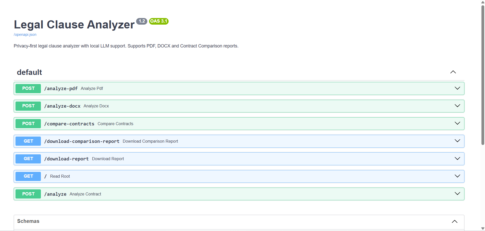
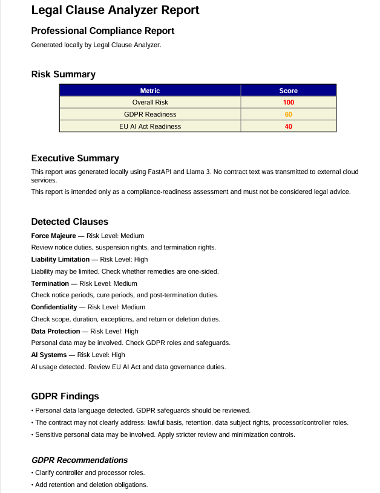
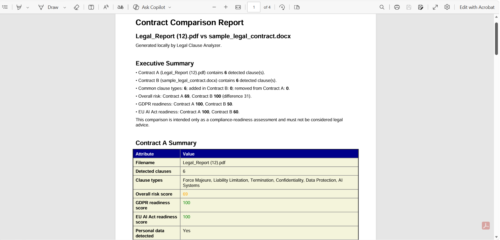

<div align="center">

# Legal Clause Analyzer

### Privacy-First AI-Powered Contract Analysis Platform

*Detect clauses. Assess GDPR & EU AI Act readiness. Score risk. Redline contracts. Generate compliance reports — all running locally.*

[](https://www.python.org/)
[](https://fastapi.tiangolo.com/)
[](https://ollama.com)
[](https://www.trychroma.com/)
[](https://www.docker.com/)
[](#testing)
[](https://github.com/soheilon21-a11y/Legal-Clause-Analyzer/actions)
[](LICENSE)
[](CHANGELOG.md) 

</div>

---

## Why This Project Matters

Legal teams review hundreds of contracts weekly, yet most clause analysis remains manual, slow, and expensive. Meanwhile, the EU AI Act and GDPR impose strict compliance obligations that many contracts fail to address.

**Legal Clause Analyzer** bridges this gap by combining deterministic rule-based analysis with local Large Language Models and Retrieval-Augmented Generation — delivering a privacy-first compliance tool that never sends confidential contract data to external cloud services.

This project demonstrates production-ready patterns for:
- **AI-assisted legal workflows** that augment — not replace — human lawyers
- **On-premise LLM deployment** for sensitive document processing
- **RAG-grounded generation** that ties AI outputs to authoritative legal sources
- **Playbook-driven redlining** that mirrors how real legal teams negotiate contracts

---

## Professional Highlights

| Area | Detail |
|---|---|
| **Version** | **Stable Release v1.0** |
| **Architecture** | Modular FastAPI Architecture following Clean Architecture and SOLID principles | 
| **Privacy** | Zero external API calls — all processing runs locally or inside Docker |
| **AI Engineering** | Local LLM (Llama 3 via Ollama), RAG pipeline (ChromaDB + sentence-transformers), prompt engineering with structured outputs |
| **LegalTech** | Playbook-based redlining, jurisdiction-aware clause rules (EU, US), GDPR & EU AI Act readiness checks |
| **Testing** | 96 pytest tests across 8 test modules covering API, models, engine, playbooks, and PDF generation |
| **DevOps** | Docker with non-root execution and health checks, GitHub Actions CI with pip caching |
| **Reporting** | Professional color-coded PDF reports for analysis, comparison, and redlining (ReportLab) |

---

## Key Features

- **Multi-format ingestion** — PDF, DOCX, and plain-text contract analysis
- **Clause detection** — Force Majeure, Liability Limitation, Termination, Confidentiality, Data Protection, AI Systems, Indemnification, Governing Law
- **GDPR readiness assessment** — personal/sensitive data detection, missing control identification
- **EU AI Act compliance** — high-risk AI term detection, control gap analysis
- **Risk scoring** — overall, GDPR readiness, and EU AI Act readiness scores (0–100)
- **AI redlining** — playbook-driven clause negotiation with lawyer-reviewable suggestions
- **Contract comparison** — side-by-side structured JSON diff with score deltas
- **Professional PDF reports** — color-coded analysis, comparison, and redline reports
- **Local LLM summaries** — opt-in Ollama-powered compliance summaries with graceful fallback
- **RAG pipeline** — LLM outputs grounded in a curated local knowledge base of legal references
- **Playbook system** — jurisdiction-aware JSON playbooks (EU, US) with configurable clause rules
- **Docker support** — production-ready container with health checks and non-root execution
- **CI pipeline** — 96-test suite on every push and pull request via GitHub Actions

---

## Architecture Overview

```
                     PDF / DOCX / Plain Text
                              │
                              ▼
               PyMuPDF / python-docx Extraction
                              │
              ┌───────────────┼───────────────┐
              ▼               ▼               ▼
     Rule-Based Clause   Redlining       Playbook
       Detection         Engine         Loader (JSON)
              │               │               │
              ▼               ▼               ▼
     ┌────────┴──────┐   Redline        Redline
     ▼               ▼   Suggestions    PDF Report
 GDPR Readiness  EU AI Act
     │               │
     └───────┬───────┘
             ▼
      Risk Score Engine
             │
             ▼
  Optional Local LLM Summary ◄── RAG Retriever (Top-3 references)
             │
             ▼
   Professional Compliance PDF Report
```

**Data flow:** Contract text is extracted, analyzed by deterministic rules, scored for risk, and optionally enriched by a local LLM whose output is grounded in retrieved legal references from a ChromaDB vector store. The redlining engine runs in parallel, comparing contract clauses against jurisdiction-aware playbooks to produce negotiation suggestions.

---

## Project Structure

```
Legal-Clause-Analyzer/
│
├── .github/
│   └── workflows/
│       └── ci.yml                      # GitHub Actions CI (96 tests)
│
├── images/                             # README screenshots
│   ├── compare-endpoint.png
│   ├── comparison-json.png
│   ├── comparison-report.png
│   ├── pdf-report.png
│   ├── swagger-v12.png
│   └── swagger.png
│
├── knowledge_base/                     # .txt reference documents for RAG
│   ├── confidentiality_clause.txt
│   ├── eu_ai_act_high_risk_ai_systems.txt
│   ├── eu_ai_act_human_oversight.txt
│   ├── force_majeure_clause.txt
│   ├── gdpr_article_13.txt
│   ├── gdpr_article_32.txt
│   ├── gdpr_article_5.txt
│   ├── gdpr_data_protection_principles.txt
│   ├── limitation_of_liability_clause.txt
│   └── termination_clause.txt
│
├── playbooks/                          # Jurisdiction-aware clause playbooks
│   ├── eu_general_commercial.json      # EU General Commercial (8 rules)
│   └── us_general_commercial.json      # US General Commercial
│
├── rag/                                # RAG pipeline package
│   ├── __init__.py
│   ├── config.py                       # Paths, collection name, chunk settings
│   ├── document_loader.py              # Loads .txt files from knowledge_base/
│   ├── text_chunker.py                 # Overlapping character-based chunking
│   ├── embeddings.py                   # sentence-transformers wrapper (lazy-loaded)
│   ├── index_builder.py                # Offline ChromaDB index builder
│   └── retriever.py                    # Top-K similarity retrieval
│
├── redlining/                          # AI redlining engine package
│   ├── __init__.py
│   ├── engine.py                       # Core redlining engine
│   ├── models.py                       # Pydantic models (Playbook, RedlineSuggestion, etc.)
│   ├── pdf_report.py                   # Redline PDF report generation
│   ├── playbook.py                     # Playbook loader and discovery
│   └── prompts.py                      # LLM prompt templates for redlining
│
├── shared/                             # Shared utilities
│   ├── __init__.py
│   └── pdf_helpers.py                  # ReportLab PDF generation helpers
│
├── tests/                              # pytest suite (96 tests)
│   ├── sample_files/
│   ├── __init__.py
│   ├── conftest.py                     # Shared fixtures (client, texts, factories)
│   ├── test_analyze.py                 # Analysis endpoint tests (10)
│   ├── test_compare.py                 # Comparison endpoint tests (7)
│   ├── test_health.py                  # Health endpoint tests (2)
│   ├── test_models.py                  # Pydantic model validation tests (18)
│   ├── test_playbook.py                # Playbook loader tests (11)
│   ├── test_redline_api.py             # Redline API endpoint tests (13)
│   ├── test_redline_pdf.py             # Redline PDF report tests (4)
│   └── test_redlining_engine.py        # Redlining engine tests (31)
│
├── main.py                             # FastAPI application
├── requirements.txt                    # Runtime dependencies
├── requirements-dev.txt                # Test dependencies
├── pytest.ini
├── Dockerfile
├── .dockerignore
├── .gitignore
├── CHANGELOG.md
├── LICENSE
└── README.md
```

---

## Installation

### Prerequisites

- **Python 3.12+**
- **[Ollama](https://ollama.com)** *(optional — only for LLM-powered summaries and redline refinement)*

### Setup

```bash
git clone https://github.com/soheilon21-a11y/Legal-Clause-Analyzer.git
cd Legal-Clause-Analyzer
```

Install runtime dependencies:

```bash
pip install -r requirements.txt
```

For development and testing:

```bash
pip install -r requirements-dev.txt
```

If you plan to use the RAG pipeline, build the knowledge-base index:

```bash
python -m rag.index_builder
```

---

## Running the API

### Start Ollama *(optional)*

```bash
ollama serve
```

### Start the server

```bash
uvicorn main:app --reload
```

Interactive API documentation is available at **http://127.0.0.1:8000/docs**.

---

## API Reference

| Method | Endpoint | Description |
|---|---|---|
| `GET` | [`/`](#) | Service status and project info |
| `POST` | [`/analyze`](#) | Analyze plain-text contracts (JSON body) |
| `POST` | [`/analyze-pdf`](#) | Analyze an uploaded PDF contract |
| `POST` | [`/analyze-docx`](#) | Analyze an uploaded DOCX contract |
| `POST` | [`/compare-contracts`](#) | Compare two PDF/DOCX contracts side-by-side |
| `GET` | [`/download-report`](#) | Download analysis PDF report |
| `GET` | [`/download-comparison-report`](#) | Download comparison PDF report |
| `GET` | [`/playbooks`](#) | List available redlining playbooks |
| `POST` | [`/redline`](#) | Redline contract text against playbooks |
| `POST` | [`/redline-pdf`](#) | Redline an uploaded PDF/DOCX file |
| `GET` | [`/download-redline-report`](#) | Download redline analysis PDF report |

### Common Parameters

All analysis and redline endpoints accept `use_llm` (default `false`). When enabled:
- Analysis endpoints return an LLM-generated compliance summary grounded in RAG-retrieved legal references.
- Redline endpoints return LLM-refined clause wording suggestions.
- If Ollama is unreachable, the API gracefully falls back to rule-based output.

### Upload Limits

All file-upload endpoints enforce a **10 MB** maximum file size (HTTP 413 on exceed).

---

## Screenshots

### Interactive API Documentation

<p align="center">
  
</p>

### Analysis Report

<p align="center">
  
</p>

### Comparison Report

<p align="center">
  
</p>

---

## AI Redlining Engine

The redlining engine (`redlining/`) provides **playbook-driven contract negotiation** — a core LegalTech workflow.

### How It Works

```
Contract Text
      │
      ▼
Playbook Loader (JSON)
      │
      ▼
Rule Matching (keyword-based clause detection)
      │
      ▼
Confidence Scoring (keyword ratio + negotiability)
      │
      ▼
Optional LLM Refinement (batch, via Ollama)
      │
      ▼
Redline Suggestions (sorted by risk: Critical → Low)
      │
      ▼
Professional Redline PDF Report
```

### Key Design Decisions

- **Never modifies contracts automatically** — all suggestions require lawyer review
- **Jurisdiction-aware playbooks** — EU and US commercial playbooks with legal guidance notes
- **Batch LLM refinement** — when `use_llm=True`, all suggestions are refined in a single LLM call for efficiency
- **Confidence scoring** — each suggestion includes a confidence score (0.0–1.0) based on keyword match ratio and negotiability
- **Risk-sorted output** — suggestions ordered Critical → High → Medium → Low

> **Human Review Required:** AI-generated redlining suggestions are designed to assist legal professionals and never replace legal judgment. All suggested revisions should be reviewed and approved by a qualified lawyer before use.

### Playbooks

Playbooks are JSON files in `playbooks/` containing clause-detection rules with:
- Detection keywords
- Preferred alternative wording
- Risk level (Critical / High / Medium / Low)
- Negotiation guidance and jurisdiction notes

New playbooks are auto-discovered — drop a `.json` file into `playbooks/` and it is picked up on the next request.

---

## RAG Architecture

The project includes a fully local **Retrieval-Augmented Generation** pipeline that grounds LLM summaries in authoritative legal references.

```
Knowledge Base (.txt files)
         │
         ▼
  Text Chunking (1000 chars, 200 overlap)
         │
         ▼
  Embeddings (BAAI/bge-small-en-v1.5, 384-dim)
         │
         ▼
  ChromaDB (persistent local vector store)
         │
         ▼
  Retriever (Top-3 similarity search)
         │
         ▼
  LLM Prompt + Retrieved References
         │
         ▼
  Grounded Summary + "Referenced Legal Sources" in PDF
```

### Pipeline Components

| Module | Responsibility |
|---|---|
| `rag/document_loader.py` | Loads every non-empty `.txt` file from `knowledge_base/` |
| `rag/text_chunker.py` | Splits documents into overlapping chunks (1000 chars, 200 overlap) |
| `rag/embeddings.py` | Generates embeddings with `BAAI/bge-small-en-v1.5` (lazy-loaded, ~130 MB) |
| `rag/index_builder.py` | Offline builder — stores chunks + metadata in ChromaDB |
| `rag/retriever.py` | Top-K similarity search over the local index |

### Vector Store

- **Engine:** ChromaDB (local, persistent)
- **Location:** `vector_store/` (created on first indexing; not committed to git)
- **Collection:** `legal_clauses`
- **Idempotent indexing:** deterministic IDs (`filename:chunk_index`) prevent duplicates on rebuild

### LLM Integration

When `use_llm=True`, the retriever fetches the Top-3 most relevant legal chunks and prepends them to the LLM prompt. The generated PDF report includes a **"Referenced Legal Sources"** section listing each retrieved document with its title, filename, and excerpt. If retrieval fails (missing index, empty collection, model error), the API silently falls back to the standard prompt. The `use_llm=False` path is completely unaffected.

### Knowledge Base

- **Location:** `knowledge_base/`
- **Format:** plain-text (`.txt`) reference documents — clause libraries, playbooks, or internal legal guidance
- **Contents:** 10 curated legal reference documents (GDPR Articles 5, 13, 32, EU AI Act provisions, standard clause templates)
- Empty files are ignored; files are loaded in deterministic filename order
- After adding or editing documents, rebuild the index: `python -m rag.index_builder`

---

## Local LLM Support

| Setting | Value |
|---|---|
| **Engine** | [Ollama](https://ollama.com) |
| **Model** | `llama3` |
| **Endpoint** | `http://127.0.0.1:11434/v1` |
| **Activation** | Opt-in per request via `use_llm=True` |
| **Fallback** | Graceful — rule-based analysis is always returned |
| **Privacy** | No contract text ever leaves the local machine |

Environment variables `OLLAMA_BASE_URL`, `OLLAMA_API_KEY`, and `LLM_MODEL` allow configuration without code changes.

---

## Docker

### Build

```bash
docker build -t legal-clause-analyzer:latest .
```

### Run

```bash
docker run -d --name legal-clause-analyzer -p 8000:8000 legal-clause-analyzer:latest
```

The API is available at **http://localhost:8000/docs**.

### Container Details

- **Base image:** `python:3.12-slim-bookworm`
- **Security:** runs as a non-root user (`app`)
- **Health check:** `GET /` every 30 seconds with 3 retries
- **Rule-based analysis** works fully offline inside the container
- **LLM features** (`use_llm=True`) require Ollama to be reachable from inside the container; otherwise the API returns its standard fallback output

---

## Testing

The project includes a comprehensive **96-test pytest suite** across 8 modules:

| Module | Tests | Coverage |
|---|---|---|
| `test_analyze.py` | 10 | Analysis endpoints (text, PDF, DOCX) |
| `test_compare.py` | 7 | Contract comparison endpoints |
| `test_health.py` | 2 | Health and root endpoints |
| `test_models.py` | 18 | Pydantic model validation (redlining) |
| `test_playbook.py` | 11 | Playbook loading and discovery |
| `test_redline_api.py` | 13 | Redline API endpoints |
| `test_redline_pdf.py` | 4 | Redline PDF report generation |
| `test_redlining_engine.py` | 31 | Core redlining engine logic |
| **Total** | **96** | |

### Current Status

✅ **96/96 tests passing**

This indicates that the entire automated test suite passes successfully for Version 1.0.

### Run Tests

```bash
pytest -v
```

---

## Continuous Integration

The GitHub Actions workflow at `.github/workflows/ci.yml` runs on **every push and pull request**:

1. Checks out the repository
2. Sets up **Python 3.12** with pip caching
3. Installs `requirements.txt` and `requirements-dev.txt`
4. Runs the full **96-test** suite with `pytest -v`

The job uses **least-privilege token permissions** (`contents: read`) and a **10-minute timeout**.

---

## Limitations

- **Keyword-based detection** — clause detection relies on keyword matching, not NLP-based semantic understanding; novel or heavily paraphrased clauses may not be detected
- **English only** — all keyword rules, playbooks, and knowledge-base documents are in English
- **Single-file analysis** — no batch processing or multi-document workflows
- **LLM quality depends on model** — Llama 3 summaries and redline refinements are approximate and always require human review
- **No persistent storage** — analysis results are held in memory only; no database or history
- **No authentication** — the API has no auth layer; not intended for direct public internet exposure
- **Playbook coverage** — ships with EU and US general commercial playbooks; domain-specific or jurisdiction-specific playbooks must be authored manually

---

## Roadmap

> Items below are planned for future versions and are not yet implemented.

- **Risk dashboard** — web UI for visualizing clause detection and risk scores
- **Split Docker images** — slim API-only image vs. full RAG + LLM image
- **Additional file formats** — support for RTF, HTML, and scanned documents (OCR)
- **Batch analysis** — multi-contract processing with aggregated reporting
- **NLP-based clause detection** — semantic clause matching beyond keyword search
- **Persistent storage** — database backend for analysis history and audit trails
- **Multi-language support** — keyword rules and playbooks for non-English contracts

---

## License

This project is licensed under the **MIT License** — see [LICENSE](LICENSE) for details.

The generated reports are **compliance-readiness assessments** and **do not constitute legal advice**. All outputs require qualified legal review before use in any decision-making context.

---

## Author

**Soheil Onsori**

**Built with Python, FastAPI, Local LLMs and Retrieval-Augmented Generation (RAG).**

**Focused on Privacy-first Legal AI.**

Legal Technology · AI Compliance · FastAPI · Local LLMs · Retrieval-Augmented Generation

[GitHub Repository](https://github.com/soheilon21-a11y/Legal-Clause-Analyzer)
